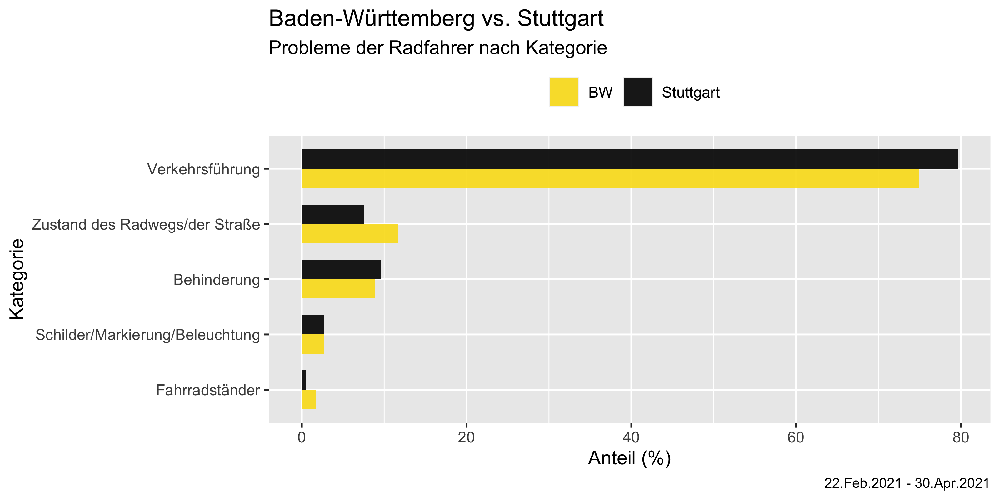
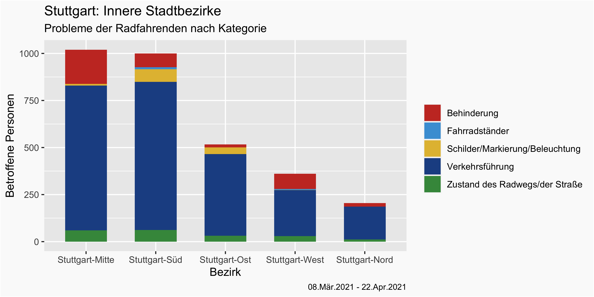
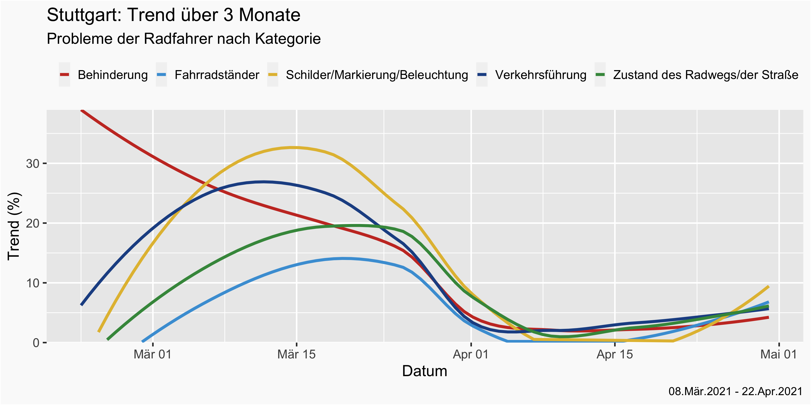
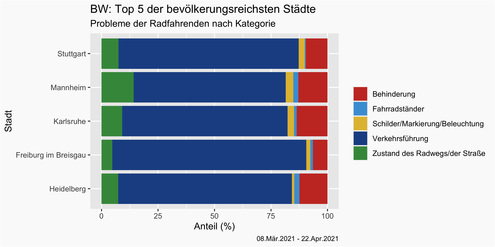

# cycling_complaints_bw_swr

## 1. Summary
The goal of this project is to process and analyze data collected by the SWR (Südwestrundfunk) in context of their [#besserRadfahren](https://www.swr.de/radfahren/besser-radfahren-im-suedwesten-106.html) campaign. The data was gathered by collecting complaints from cyclists in the south-west of Germany (Baden-Württemberg and Rheinland-Pfalz). The resulting dataset can be sccessed [here](https://www.govdata.de/web/guest/daten/-/details/besserradfahren-swr-umfrage) through _GovData.de_.
The pre-processing and short analysis focus on the state of Baden-Württemberg and in particular on its capital city, Stuttgart.

The analysis is performed in R and presented in a R markdown format.

## 2. Data Cleaning

## 3. Insights
This serves as an overview of the results from the performed analysis. Short chapters display most notable insights accompanied by some context-providing commentary.

### 3.1 Baden-Württemberg vs. Stuttgart
The first analysis focuses on the differences between Baden-Württemberg and Stuttgart in regard to the five main categories of complaints submitted by cyclists.

  

We can observe that for both reagions the overwhelming cause of complaints with roughly 80% is _Verkehrsführung_, the layout of cycling roads. With Stuttgart being the capital city and containging high amounts of traffic while simultaniously having a relatively weak cycling infrastructure, it is expected to have a bigger problem with _Verkehrsführung_ than the state as a whole. The same circumstances also likely result in the higher amount of _Behinderung_, obstructions on the cycling roads.
On the other hand, _Zustand des Radwegs/der Straße_, the road conditions, seem to cause close to half as many problems in Stuttgart as in the state. However, this is likely because the cyclist in Stuttgart are forced to drive on roads intended for cars and these are mostly well maintained.
Further, the data seems to indicate that the situation regarding _Fahrradständer_, bike parking racks, in Stuttgart is very good and significantly better than in the state.

### 3.2 Inner City Districts of Stuttgart
Inspecting the five inner city districts of Stuttgart, we observe that the most problematic district are the city center and the south. While some aspects, such as the road layout and the road conditions are almost identical, there are significant differences in the other categories. Most notably, in the amount of obstructions where the situation in the city center is more than twice as bad as in the south. On the other hand, _Schilder/Markierung/Beleuchtung_, the road signs/markings/illumination seems to be, by far, the worst the the south of the city.

  

 
### 3.3 Progression of Complaints over Time in Stuttgart
Viewing the timeline of complaints submitted in Stuttgart, we observe an overarching trend throughout almost all categories. There is a constant increase in contributions from cyclists that culminates in a peak at around mid March and then drops off before reaching plateau at the beginning of April. The only outlier to this behavior are the obstructions on the roads which display a contant downward trend.
Disregarding the outlier and speculating about the reasons behind this overarching trend, it would be wishful thinking and very unlikely that all of the reported problems were resolved in a matter of weeks. Likely, the majority of the problematic spots across the city have just been mapped by the cyclists and ,as change moves slowly, only a handful of those prblems has been resolved.

  

### 3.4 Five Largest Cities in Baden-Württemberg

To conclude this short analysis, we look at the top five cities with the highest population in Baden-Württemberg. Doing so, allows us to also compare Stuttgart with 4 other cities.

  

The comparison reveals once again that Stuttgart has relatively good road conditions and that the problem of a bad cycling road layout affects the city to a similar extent as other cities. Further, the road signs, markings and illumination in Stuttgart seem to be average while problems with bike parking racks seem almost non-existent. Most surprisingly, out of the five largest cities Stuttgart ranks the second best in regard to the nr. of obstructions on the cycling roads while being the largest and having almost four times the population of the smallest city on the list and twice its density.
